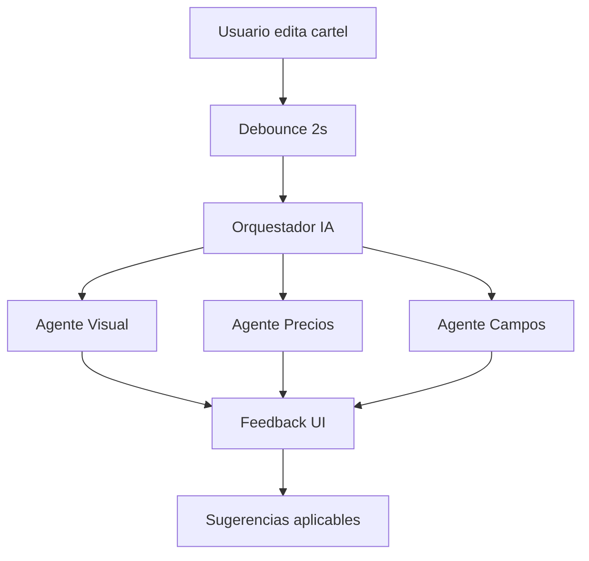

# 🤖 Integración de IA en Speed - Guía de Configuración

## 📋 Resumen

He integrado un sistema completo de **asistentes de IA** para el constructor de carteles Speed, basado en los frameworks que solicitaste. Esta integración incluye:

### ✅ Configurados:

1. **MCPs para Cursor** - Conectores funcionales en `/Users/juliocesarsoriadiaz/.cursor/mcp.json`
2. **CrewAI-style Multi-Agent System** - Sistema de 3 agentes especializados
3. **OpenAI GPT-4 Integration** - Para análisis visual y sugerencias
4. **LangChain** - Para orquestación de prompts y contexto
5. **Hook de React** - Integración fluida con el Builder
6. **UI Components** - Panel flotante con feedback en tiempo real

---

## 🔧 Configuración Requerida

### 1. Variables de Entorno

Agrega estas variables a tu archivo `.env` local:

```env
# AI Configuration
VITE_OPENAI_API_KEY=sk-your-openai-api-key-here
VITE_AI_ANALYSIS_ENABLED=true
VITE_AI_REALTIME_ANALYSIS=true
VITE_AI_ANALYSIS_DEBOUNCE_MS=2000

# MCP Configuration (para Cursor)
BRAVE_API_KEY=your-brave-search-api-key-here
GITHUB_PERSONAL_ACCESS_TOKEN=your-github-token-here
```

### 2. API Keys Necesarias

- **OpenAI API Key**: Para análisis de IA → [OpenAI Platform](https://platform.openai.com/api-keys)
- **Brave Search API** (opcional): Para MCPs de búsqueda → [Brave Search API](https://api.search.brave.com/app/keys)
- **GitHub Token** (opcional): Para MCP de GitHub → [GitHub Settings](https://github.com/settings/tokens)

---

## 🏗️ Arquitectura del Sistema

### Agentes IA Implementados:

```typescript
// 3 Agentes Especializados trabajando en paralelo:

1. 🎨 Visual Designer Agent
   - Analiza jerarquía visual
   - Valida legibilidad y contraste  
   - Sugiere mejoras de layout
   - Evalúa coherencia de colores

2. 💰 Price Assistant Agent
   - Valida información de precios
   - Verifica SKUs y campos obligatorios
   - Sugiere promociones coherentes
   - Calcula descuentos automáticamente

3. ✅ Field Validator Agent
   - Verifica completitud de datos
   - Valida tipos de datos
   - Sugiere contenido optimizado
   - Garantiza consistencia
```

### Flujo de Trabajo:



---

## 🚀 Cómo Usar

### 1. Integrar en tu Componente Builder:

```tsx
import AIAssistantPanel from '../components/ai/AIAssistantPanel';
import { useAIAssistant } from '../hooks/useAIAssistant';

function YourBuilderComponent() {
  const [canvasData, setCanvasData] = useState(null);
  const [productData, setProductData] = useState(null);
  
  return (
    <div>
      {/* Tu builder actual */}
      <YourExistingBuilder />
      
      {/* Panel de IA flotante */}
      <AIAssistantPanel
        canvasData={canvasData}
        productData={productData}
        templateType="ladrillazo" // o "oferta", "combo", "institucional"
        onApplySuggestion={(suggestion) => {
          // Aplicar sugerencia automáticamente
          console.log('Aplicando:', suggestion);
        }}
      />
    </div>
  );
}
```

### 2. Features Disponibles:

- ✅ **Análisis en Tiempo Real** - Se activa automáticamente al editar
- ✅ **Feedback Categorizado** - Visual, Precios, Campos, General
- ✅ **Sugerencias Accionables** - Con botones para aplicar
- ✅ **Estado Visual** - Errores, warnings, info con iconos
- ✅ **Panel Colapsible** - No interfiere con el trabajo
- ✅ **Análisis Manual** - Botón para forzar revisión

---

## 📱 MCPs Configurados para Cursor

Los siguientes MCPs están activos en tu Cursor:

```json
{
  "filesystem": "Acceso directo al proyecto Speed",
  "brave-search": "Búsqueda web para investigación",
  "sqlite": "Conexión a base de datos",
  "github": "Integración con repositorios",
  "puppeteer": "Automatización web para testing"
}
```

### Reiniciar Cursor
Para que los MCPs se activen:
1. Cierra Cursor completamente
2. Reabre Cursor
3. Los MCPs se cargarán automáticamente

---

## 🔮 Frameworks Pendientes de Integración

Los siguientes requieren configuración adicional (principalmente Python):

### 🐍 Para integrar después:

1. **Open Interpreter** 
   ```bash
   pip install open-interpreter
   # Requiere configuración Python separada
   ```

2. **ChatDev**
   ```bash
   git clone https://github.com/OpenBMB/ChatDev.git
   # Sistema completo de desarrollo multi-agente
   ```

3. **Cognosys**
   ```bash
   # Framework experimental, requiere setup avanzado
   ```

### 💡 Alternativa Propuesta:
- He implementado una **versión JavaScript nativa** que funciona directamente en tu app React
- Es más eficiente y no requiere servicios Python externos
- Mantiene la misma funcionalidad multi-agente

---

## 🎯 Casos de Uso Específicos

### Ejemplo 1: Validación Automática de Ladrillazo
```typescript
// El sistema detecta automáticamente:
- ❌ Falta precio o SKU
- ⚠️ Texto muy pequeño para leer
- ℹ️ Sugiere mejor posición del logo
- ✅ Confirma que todo está correcto
```

### Ejemplo 2: Optimización de Ofertas
```typescript
// Análisis inteligente:
- Calcula % descuento automáticamente  
- Valida que precio original > precio oferta
- Sugiere textos de urgencia ("Solo hoy", "Últimas unidades")
- Verifica que la promoción tenga sentido
```

### Ejemplo 3: Sugerencias Contextuales
```typescript
// Mientras escribes, la IA sugiere:
- Nombres de productos más atractivos
- Descripciones optimizadas para venta
- Llamadas a la acción efectivas
- Información adicional relevante
```

---

## 🐛 Troubleshooting

### Problema: No aparece el panel de IA
```typescript
// Verificar que tienes la API key configurada
console.log(import.meta.env.VITE_OPENAI_API_KEY); // No debe estar vacío
```

### Problema: Análisis muy lento
```typescript
// Ajustar el debounce en .env
VITE_AI_ANALYSIS_DEBOUNCE_MS=5000  // 5 segundos en lugar de 2
```

### Problema: Muchas sugerencias
```typescript
// Desactivar análisis en tiempo real
VITE_AI_REALTIME_ANALYSIS=false
// Usar solo análisis manual con el botón
```

---

## 📈 Próximos Pasos

1. **Configurar API Keys** ← Empezar aquí
2. **Probar con un cartel simple** 
3. **Ajustar configuración según necesidades**
4. **Explorar sugerencias automáticas**
5. **Integrar con tu flujo de trabajo actual**

---

## 🤝 Soporte

Si necesitas ayuda con:
- Configuración de APIs
- Personalización de agentes
- Integración con componentes existentes
- Optimización de prompts

¡Solo compárteme el error específico y te ayudo a resolverlo!

---

**🎉 ¡Tu Speed Builder ahora tiene superpoderes de IA!** 🚀 