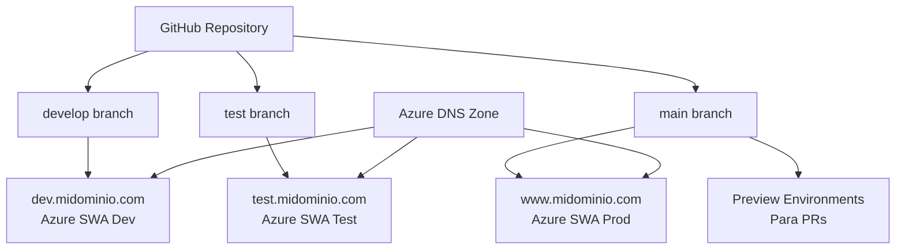

# 🚀 Guía de Despliegue Azure Static Web Apps

Esta guía te llevará paso a paso para configurar la infraestructura completa de despliegue en Azure.

## 📋 Arquitectura del Proyecto



## 🛠️ Prerrequisitos

1. **Azure CLI** instalado y configurado
2. **PowerShell** (Windows) o **Azure Cloud Shell**
3. **Cuenta de GitHub** con permisos en el repositorio
4. **Dominio** que quieras usar (se puede comprar en Azure)

## 📊 Costos Estimados

| Servicio | Costo Mensual | Costo Anual |
|----------|---------------|-------------|
| Azure Static Web Apps (3x Free) | $0 | $0 |
| App Service Domain | ~$1.50 | ~$18 |
| Azure DNS Zone | ~$0.50 | ~$6 |
| GitHub Actions (repo privado) | Variable | ~$0-50 |
| **TOTAL** | **~$2** | **~$24-74** |

## 🚀 Pasos de Configuración

### Paso 1: Preparar el Repositorio

```bash
# 1. Crear las ramas necesarias
git checkout -b develop
git push origin develop

git checkout -b test  
git push origin test

git checkout main  # o master
```

### Paso 2: Configurar Variables de Entorno

Crea archivos `.env` para cada entorno:

#### `.env.development`
```env
VITE_ENVIRONMENT=development
VITE_API_BASE_URL=https://api-dev.midominio.com
VITE_SUPABASE_URL=tu_supabase_url
VITE_SUPABASE_ANON_KEY=tu_supabase_key
```

#### `.env.testing`
```env
VITE_ENVIRONMENT=testing
VITE_API_BASE_URL=https://api-test.midominio.com
VITE_SUPABASE_URL=tu_supabase_url
VITE_SUPABASE_ANON_KEY=tu_supabase_key
```

#### `.env.production`
```env
VITE_ENVIRONMENT=production
VITE_API_BASE_URL=https://api.midominio.com
VITE_SUPABASE_URL=tu_supabase_url
VITE_SUPABASE_ANON_KEY=tu_supabase_key
```

### Paso 3: Ejecutar Script de Creación de Recursos

```powershell
# 1. Navegar al directorio del proyecto
cd azure-setup

# 2. Ejecutar el script de creación
.\create-resources.ps1 -ResourceGroupName "mi-proyecto-rg" -DomainName "midominio.com" -GitHubRepoUrl "https://github.com/tu-usuario/tu-repo"
```

### Paso 4: Configurar GitHub Secrets

Ve a tu repositorio en GitHub → Settings → Secrets and variables → Actions

Agrega estos secrets:

```
AZURE_STATIC_WEB_APPS_API_TOKEN_DEV=<token-dev>
AZURE_STATIC_WEB_APPS_API_TOKEN_TEST=<token-test>  
AZURE_STATIC_WEB_APPS_API_TOKEN_PROD=<token-prod>
VITE_SUPABASE_URL=<tu-supabase-url>
VITE_SUPABASE_ANON_KEY=<tu-supabase-key>
VITE_API_BASE_URL_DEV=<api-dev-url>
VITE_API_BASE_URL_TEST=<api-test-url>
VITE_API_BASE_URL_PROD=<api-prod-url>
```

### Paso 5: Configurar Dominios Personalizados

#### A través del Portal de Azure:

1. Ve a cada Azure Static Web App
2. Settings → Custom domains
3. Agrega el dominio correspondiente:
   - Dev SWA: `dev.midominio.com`
   - Test SWA: `test.midominio.com`
   - Prod SWA: `www.midominio.com`

#### A través de CLI:

```powershell
# Para cada Static Web App
az staticwebapp hostname set --name "midominio-dev" --resource-group "mi-proyecto-rg" --hostname "dev.midominio.com"
az staticwebapp hostname set --name "midominio-test" --resource-group "mi-proyecto-rg" --hostname "test.midominio.com"
az staticwebapp hostname set --name "midominio-prod" --resource-group "mi-proyecto-rg" --hostname "www.midominio.com"
```

### Paso 6: Configurar DNS

```powershell
# Ejecutar script de DNS
.\setup-dns.ps1 -ResourceGroupName "mi-proyecto-rg" -DomainName "midominio.com" -DevSwaUrl "dev-swa-url" -TestSwaUrl "test-swa-url" -ProdSwaUrl "prod-swa-url"
```

## 🔄 Flujo de Trabajo

### Desarrollo Normal
```bash
git checkout develop
# ... hacer cambios
git commit -m "feat: nueva funcionalidad"
git push origin develop
# ✅ Se despliega automáticamente en dev.midominio.com
```

### Testing/Staging
```bash
git checkout test
git merge develop
git push origin test
# ✅ Se despliega automáticamente en test.midominio.com
```

### Producción
```bash
# 1. Crear PR hacia main
git checkout main
git pull origin main

# 2. Crear branch para feature
git checkout -b feature/nueva-funcionalidad
# ... hacer cambios
git push origin feature/nueva-funcionalidad

# 3. Crear PR en GitHub
# ✅ Se crea preview environment automático

# 4. Después de aprobar el PR
git checkout main
git merge feature/nueva-funcionalidad
git push origin main
# ✅ Se despliega automáticamente en www.midominio.com
```

## 🔍 Monitoreo y Logs

### Ver logs de despliegue:
```bash
# GitHub Actions
https://github.com/tu-usuario/tu-repo/actions

# Azure Portal
https://portal.azure.com → Static Web Apps → tu-app → Functions → Monitor
```

### Verificar estado:
```bash
# Verificar que los sitios respondan
curl -I https://dev.midominio.com
curl -I https://test.midominio.com  
curl -I https://www.midominio.com
```

## 🚨 Troubleshooting

### Problema: El dominio no resuelve
**Solución:** 
1. Verificar nameservers en Azure DNS
2. Confirmar configuración en el registrador
3. Esperar propagación DNS (hasta 48h)

### Problema: GitHub Actions falla
**Solución:**
1. Verificar tokens en GitHub Secrets
2. Revisar permisos del token
3. Verificar que las ramas existan

### Problema: Certificado SSL no se genera
**Solución:**
1. Verificar que el dominio apunte correctamente
2. Esperar hasta 24h para generación automática
3. Verificar en Azure Portal → Static Web App → Custom domains

## 📚 Recursos Adicionales

- [Azure Static Web Apps Documentation](https://docs.microsoft.com/en-us/azure/static-web-apps/)
- [GitHub Actions for Azure](https://github.com/Azure/actions)
- [Azure DNS Documentation](https://docs.microsoft.com/en-us/azure/dns/)

## 🎉 ¡Listo!

Con esta configuración tendrás:
- ✅ 3 entornos completamente separados
- ✅ CI/CD automático
- ✅ Preview environments para PRs
- ✅ Dominios personalizados con HTTPS
- ✅ Costos mínimos (casi gratis)
- ✅ Escalabilidad automática
