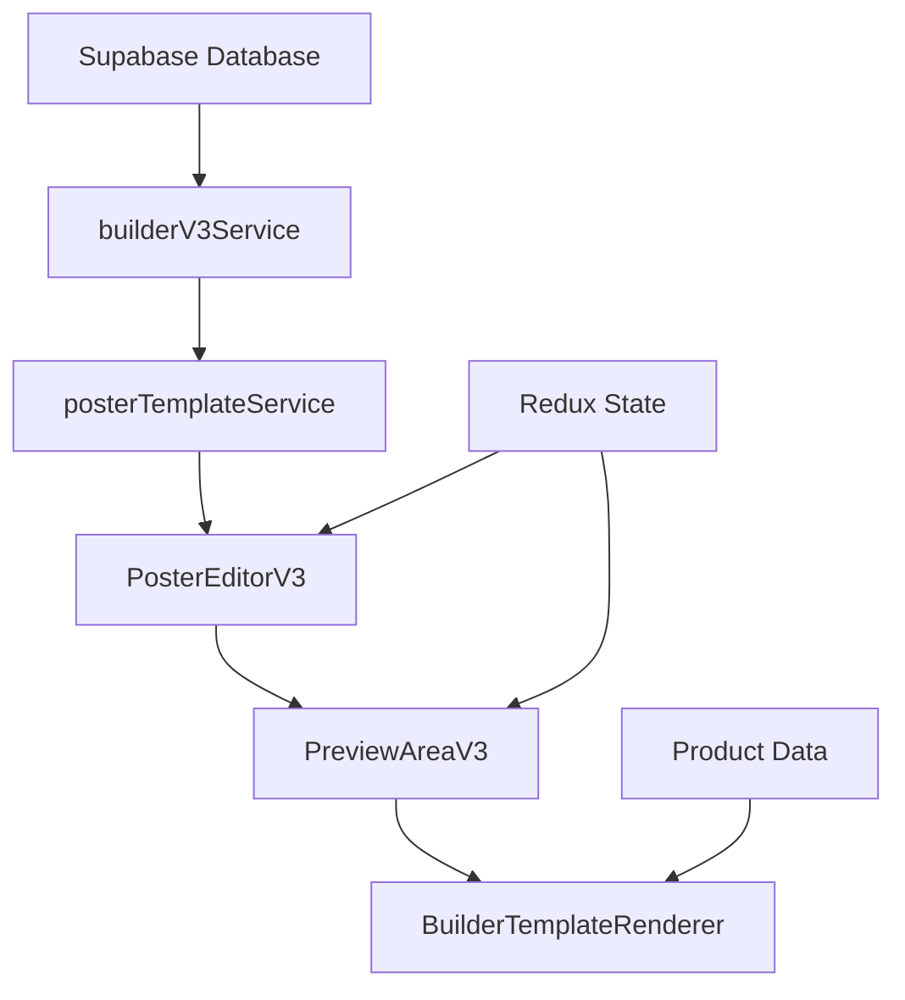

# Sistema de Posters Dinámico V3 - Guía Completa

## 🚀 Nueva Arquitectura Implementada

El sistema de posters ha sido **completamente refactorizado** para eliminar las dependencias estáticas y crear un sistema 100% dinámico basado en familias y plantillas del Builder V3.

## 🔄 Cambios Principales

### ❌ Sistema Anterior (Eliminado)
- Plantillas estáticas hardcodeadas (`Ladrillazos1.tsx`, `FeriaDescuento2.tsx`, etc.)
- Mapeo manual de componentes (`PLANTILLA_MODELOS`)
- Lógica de filtrado compleja y específica para cada familia
- Nombres de plantillas hardcodeados

### ✅ Sistema Nuevo V3
- **Renderizador único:** `BuilderTemplateRenderer` que interpreta cualquier plantilla dinámicamente
- **Fuente de datos única:** Base de datos de Supabase con familias y plantillas
- **Escalabilidad total:** Agregar nuevas familias/plantillas sin tocar código
- **Datos inteligentes:** Renderizado con datos reales de productos

## 📁 Estructura de Archivos

```
src/
├── services/
│   └── posterTemplateService.ts          # Servicio principal del nuevo sistema
├── features/
│   └── posters/
│       └── components/
│           └── Posters/
│               ├── PosterEditorV3.tsx    # Editor principal V3
│               └── Editor/
│                   ├── PreviewAreaV3.tsx # Área de preview V3
│                   └── Renderers/
│                       └── BuilderTemplateRenderer.tsx # Renderizador único
```

## 🎯 Componentes Principales

### 1. `PosterEditorV3`
**Función:** Editor principal del nuevo sistema
**Características:**
- Carga familias dinámicamente desde la base de datos
- Interfaz limpia para selección de familias y productos
- Gestión de estado optimizada con Redux
- Sin dependencias del sistema anterior

### 2. `PreviewAreaV3`
**Función:** Área de vista previa inteligente
**Características:**
- Muestra grilla de plantillas disponibles por familia
- Vista detallada de plantilla seleccionada
- Edición en tiempo real de campos de productos
- Manejo de productos múltiples con diseño tipo cartel

### 3. `BuilderTemplateRenderer`
**Función:** Renderizador universal de plantillas
**Características:**
- Interpreta cualquier plantilla del Builder V3
- Mapeo inteligente de datos de productos a componentes
- Escalado automático para vistas previas
- Soporte completo para todos los tipos de componentes

### 4. `posterTemplateService`
**Función:** Servicio de datos dinámico
**Características:**
- Conecta con `builderV3Service` para obtener familias y plantillas
- Transforma datos de Supabase a formato optimizado para posters
- Funciones de búsqueda y filtrado
- Cache y optimización de rendimiento

## 🔧 Uso del Nuevo Sistema

### Importación Básica
```typescript
import { 
  PosterEditorV3, 
  posterTemplateService,
  type PosterFamilyData,
  type PosterTemplateData 
} from 'src/features/posters/components/Posters';
```

### Carga de Familias y Plantillas
```typescript
// Obtener todas las familias con sus plantillas
const families = await posterTemplateService.getAllFamiliesWithTemplates();

// Obtener plantillas de una familia específica
const templates = await posterTemplateService.getTemplatesByFamily('family-id');

// Buscar plantillas por nombre
const results = await posterTemplateService.searchTemplates('hot sale');
```

### Renderizado de Plantillas
```typescript
import { BuilderTemplateRenderer } from './Renderers/BuilderTemplateRenderer';

<BuilderTemplateRenderer 
  template={templateData.template}
  components={templateData.template.defaultComponents}
  product={productData} // Opcional: datos del producto
  isPreview={true} // Para vista previa con datos de ejemplo
  scale={0.5} // Escala para vistas previas pequeñas
/>
```

## 📊 Flujo de Datos



## 🎨 Características del Renderizador

### Tipos de Componentes Soportados
- **`field-dynamic-text`:** Texto dinámico con datos de productos
- **`image-header/product/brand-logo/decorative`:** Imágenes inteligentes
- **`qr-dynamic`:** Códigos QR generados dinámicamente
- **`field-dynamic-date`:** Fechas de promociones
- **`shape-geometric`:** Formas geométricas personalizables
- **`decorative-line/icon`:** Elementos decorativos
- **`container-flexible/grid`:** Contenedores de layout

### Mapeo Inteligente de Datos
```typescript
// El renderizador mapea automáticamente:
product.name → componente 'product-name'
product.price → componente 'price-original' con formato de moneda
product.sku → componente 'product-sku'
product.imageUrl → componente 'image-product'
```

## 🔄 Migración del Sistema Anterior

### Pasos de Migración
1. **Reemplazar imports:**
   ```typescript
   // Antes
   import { PosterEditor } from './PosterEditor';
   
   // Después
   import { PosterEditorV3 } from './PosterEditorV3';
   ```

2. **Actualizar props:**
   ```typescript
   // Antes
   <PosterEditor 
     templateComponents={components}
     PLANTILLA_MODELOS={models}
     plantillaSeleccionada={template}
     // ... muchas props más
   />
   
   // Después
   <PosterEditorV3 
     onBack={onBack}
     onLogout={onLogout}
     userEmail={email}
     userName={name}
   />
   ```

3. **Eliminar dependencias obsoletas:**
   - Archivos de plantillas estáticas (`src/constants/templates/`)
   - Mapeos manuales (`PLANTILLA_MODELOS`)
   - Lógica de filtrado hardcodeada

## 🚀 Beneficios del Nuevo Sistema

### Para Desarrolladores
- **90% menos código:** Eliminación de plantillas estáticas
- **Escalabilidad infinita:** Nuevas plantillas sin tocar código
- **Mantenimiento mínimo:** Un solo renderizador para todas las plantillas
- **Testing simplificado:** Lógica centralizada y predecible

### Para el Negocio
- **Tiempo de implementación:** De semanas a minutos para nuevas plantillas
- **Flexibilidad total:** Cambios de diseño desde el Builder sin deployments
- **Consistencia garantizada:** Mismo motor de renderizado para todo
- **Escalabilidad empresarial:** Soporta miles de plantillas sin pérdida de rendimiento

### Para Usuarios
- **Interfaz más limpia:** Navegación intuitiva por familias
- **Vista previa en tiempo real:** Cambios instantáneos en plantillas
- **Rendimiento optimizado:** Carga más rápida y fluida
- **Funcionalidad completa:** Todas las características del Builder disponibles

## 🔮 Próximos Pasos

1. **Migración gradual:** Reemplazar `PosterEditor` con `PosterEditorV3` en producción
2. **Limpieza de código:** Eliminar archivos obsoletos del sistema anterior
3. **Optimizaciones:** Cache avanzado y lazy loading de plantillas
4. **Nuevas características:** Plantillas colaborativas, versionado, etc.

## 🛠️ Troubleshooting

### Problema: "No se cargan las familias"
**Solución:** Verificar configuración de Supabase en `builderV3Service`

### Problema: "Plantillas no se renderiza correctamente"
**Solución:** Verificar que los componentes tengan la estructura correcta en la base de datos

### Problema: "Datos de productos no aparecen"
**Solución:** Verificar que el `BuilderTemplateRenderer` reciba la prop `product`

---

## 📝 Conclusión

El Sistema de Posters V3 representa una **evolución completa** hacia un sistema:
- 🎯 **Dinámico por diseño**
- 🚀 **Escalable sin límites** 
- 🔧 **Mantenible con facilidad**
- 💡 **Inteligente en automatización**

Esta refactorización elimina completamente la deuda técnica del sistema anterior y establece las bases para el crecimiento futuro de la plataforma. 